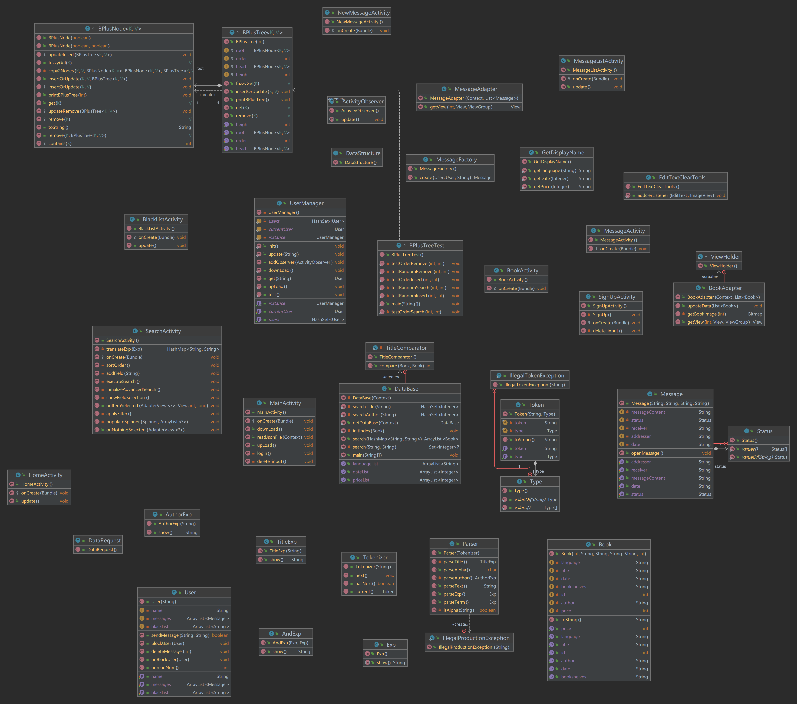

# [G25 - Elite 25] Report

The following report provides all the necessary details necessary for team project that focuses on a book search application. This project involves search queries, using data structures for efficient data storage and retrieval, and integrating Firebase for user authentication and data storage. Additionally, the report provides insight into team management, including aspects like team meetings and conflict resolution etc. Overall, this report aims to give a comprehensive overview of our team's approachs, challenges, and accomplishments during the project development.

## Table of Contents

1. [Team Members and Roles](#team-members-and-roles)
2. [Summary of Individual Contributions](#summary-of-individual-contributions)
3. [Application Description](#application-description)
4. [Application UML](#application-uml)
5. [Application Design and Decisions](#code-design-and-decisions)
6. [Summary of Known Errors and Bugs](#summary-of-known-errors-and-bugs)
7. [Testing Summary](#testing-summary)
8. [Implemented Features](#implemented-features)
9. [Team Meetings](#meetings-records)
10. [Conflict Resolution Protocol](#conflict-resolution-protocol)

## Administrative
- Firebase Repository Link: <insert-link-to-firebase-repository>
   - Confirm: I have already added comp21006442@gmail.com as a Developer to the Firebase project prior to due date.
- Two user accounts for markers' access are usable on the app's APK (do not change the username and password unless there are exceptional circumstances. Note that they are not real e-mail addresses in use):
   - Username: comp2100@anu.edu.au	Password: comp2100
   - Username: comp6442@anu.edu.au	Password: comp6442

## Team Members and Roles
The key area(s) of responsibilities for each member

| UID      |     Name     |                                    Role |
|:---------|:------------:|----------------------------------------:|
| u7572670 |  Yusen Nian  |                 Building data structure |
| u7588890 |   Wenyi Pi   |                        Front-end search |
| u7572718 | Fangzhou Liu | Wring classes of database and messaging |
| u7582493 |  Ziyu Wang   |                 Firebase related issues |

## Summary of Individual Contributions

1. **u7572670, Yusen Nian**  I have 25% contribution, as follows:  
  - **Code Contribution in the final App**
    - Feature sending messages - class Message: [Message.java](https://gitlab.cecs.anu.edu.au/u7572718/ga-23s2/-/blob/main/app/src/main/java/com/group/bookstore/backend/Message.java),class User: [User.java](https://gitlab.cecs.anu.edu.au/u7572718/ga-23s2/-/blob/main/app/src/main/java/com/group/bookstore/backend/User.java)
    - Data structure b+ tree -  class DataStructure: [DataStructure.java](https://gitlab.cecs.anu.edu.au/u7572718/ga-23s2/-/blob/main/app/src/main/java/com/group/bookstore/database/DataStructure.java)
    - Basic UI - [MainActivity.java](https://gitlab.cecs.anu.edu.au/u7572718/ga-23s2/-/blob/main/app/src/main/java/com/group/bookstore/frontend/MainActivity.java), [HomeActivity.java](https://gitlab.cecs.anu.edu.au/u7572718/ga-23s2/-/blob/main/app/src/main/java/com/group/bookstore/frontend/HomeActivity.java), [SearchActivity.java](https://gitlab.cecs.anu.edu.au/u7572718/ga-23s2/-/blob/main/app/src/main/java/com/group/bookstore/frontend/SearchActivity.java)  

  - **Code and App Design** 
    - I used factory pattern to creat message instance and used b+ tree for storing and searching.
    - I created 3 basic interfaces - mainactivity for login, homeactivity for choosing functions, searchactivity for searching books.   

  - **Others**:  
    - Participant in report writing.
    - Participant in slides preparation.   

2. **u7588890, Wenyi Pi**  I have 25% contribution, as follows:  
  - **Code Contribution in the final App**
    - Feature SearchActivity - Tokenizer: [Tokenizer](https://gitlab.cecs.anu.edu.au/u7572718/ga-23s2/-/tree/main/app/src/main/java/com/group/bookstore/backend/tokenizer),Parser:[Parser](https://gitlab.cecs.anu.edu.au/u7572718/ga-23s2/-/tree/main/app/src/main/java/com/group/bookstore/backend/parser)
    - Adapter -  class MessageAdapter: [MessageAdapter.java](https://gitlab.cecs.anu.edu.au/u7572718/ga-23s2/-/blob/main/app/src/main/java/com/group/bookstore/frontend/adapter/MessageAdapter.java), class BookAdapter:[BookAdapter.java](https://gitlab.cecs.anu.edu.au/u7572718/ga-23s2/-/blob/main/app/src/main/java/com/group/bookstore/frontend/adapter/BookAdapter.java)
    - Basic UI - [MessageActivity.java](https://gitlab.cecs.anu.edu.au/u7572718/ga-23s2/-/blob/main/app/src/main/java/com/group/bookstore/frontend/MessageActivity.java), [HomeActivity.java](https://gitlab.cecs.anu.edu.au/u7572718/ga-23s2/-/blob/main/app/src/main/java/com/group/bookstore/frontend/HomeActivity.java), [SearchActivity.java](https://gitlab.cecs.anu.edu.au/u7572718/ga-23s2/-/blob/main/app/src/main/java/com/group/bookstore/frontend/SearchActivity.java)  

  - **Code and App Design** 
    - I used toknizer and parser for search query.
    - I provided an interface for users to search for books based on various criteria in various ways and provide an interface for showing the message list.   

  - **Others**:  
    - Participant in report writing.
       

3. **u7572718, Fangzhou Liu** I have 25% contribution, as follows:  
- **Code Contribution in the final App**
    - Feature load data to a database class from json file and created inverted index on different fields; enabling searching and filtering data from database: class DataBase: [DataBase](https://gitlab.cecs.anu.edu.au/u7572718/ga-23s2/-/tree/main/app/src/main/java/com/group/bookstore/database/DataBase.java)
    - Feature load data from Firebase; enabling messaging; auto reload data from Firebase on data change: class UserManager: [UserManager](https://gitlab.cecs.anu.edu.au/u7572718/ga-23s2/-/tree/main/app/src/main/java/com/group/bookstore/backend/UserManager.java), class ActivityObserver: [ActivityObserver](https://gitlab.cecs.anu.edu.au/u7572718/ga-23s2/-/tree/main/app/src/main/java/com/group/bookstore/backend/ActivityObserver.java), class MessageFactory: [MessageFactory](https://gitlab.cecs.anu.edu.au/u7572718/ga-23s2/-/tree/main/app/src/main/java/com/group/bookstore/backend/MessageFactory.java)
    - Basic UI - [BlacklistActivity](https://gitlab.cecs.anu.edu.au/u7572718/ga-23s2/-/blob/main/app/src/main/java/com/group/bookstore/frontend/BlackListActivity.java), [MessageListActivity](https://gitlab.cecs.anu.edu.au/u7572718/ga-23s2/-/blob/main/app/src/main/java/com/group/bookstore/frontend/MessageListActivity.java), [NewMessageActivity](https://gitlab.cecs.anu.edu.au/u7572718/ga-23s2/-/blob/main/app/src/main/java/com/group/bookstore/frontend/NewMessageActivity.java)
    - Tests of sending messages and database - DatabaseTest[DatabaseTest](https://gitlab.cecs.anu.edu.au/u7572718/ga-23s2/-/blob/main/app/src/androidTest/java/com/group/bookstore/DatabaseTest.java), MessageTest[MessageTest](https://gitlab.cecs.anu.edu.au/u7572718/ga-23s2/-/blob/main/app/src/androidTest/java/com/group/bookstore/MessageTest.java)  

- **Code and App Design**
  - I used singleton pattern to save user and message info in UserManager class and book data info in DataBase class
  - I used observer pattern to update display info for MainActivity, MessageListActivity and BlackListActivity when data change on Firebase
  - I provided a single database to load book data from json file and enabling searching in terms of different fields and filters   

- **Others**:
    - Participant in report writing.   

4. **u7582493, Ziyu Wang** I have a 25% contribution, as follows:

- **Code Contribution in the final App**
   - Design App UI and finish firebase authenticationBasic UI - [MainActivity](https://gitlab.cecs.anu.edu.au/u7572718/ga-23s2/-/blob/main/app/src/main/java/com/group/bookstore/frontend/MainActivity.java), [SignUpActivity](https://gitlab.cecs.anu.edu.au/u7572718/ga-23s2/-/blob/main/app/src/main/java/com/group/bookstore/frontend/SignUpActivity.java), [HomeActivity](https://gitlab.cecs.anu.edu.au/u7572718/ga-23s2/-/blob/main/app/src/main/java/com/group/bookstore/frontend/HomeActivity.java) 
    - UI tool- [EditTextClearTools.java](https://gitlab.cecs.anu.edu.au/u7572718/ga-23s2/-/blob/main/app/src/main/java/com/group/bookstore/frontend/EditTextClearTools.java)   

- **Code and App Design**
   - I design and fix the App UI.
   - Link to firebase and transfer data.   

 - **Others**
   - Participate in report writing.   

## Application Description

**App Name:** MyBookFinder

**App Description:**

Welcome to MyBookFinder - your perfect book search companion!

**Key Features:**

- 🔍 **Effortless Book Searching**
  Finding your favorite books has never been easier. Our powerful search engine allows you to easily discover the books you love, whether it's novels, textbooks, scientific manuals, or any other genre.

- 📚 **Detailed Book Information**
  Click on a book, and you'll get all the information about it, from the author and publication date to summaries. Our app helps you make informed reading choices.

- 🌟 **Personalized Filters**
  With MyBookFinder, you have access to intelligent filters that cater to your specific needs. You can precisely filter search results based on author, publication year, and price, ensuring you find the perfect read.

- 💬 **Online Chat Community**
  In our app, you can discover not only books but also like-minded book enthusiasts. Utilize our online chat feature to share your book lists, recommendations, or simply engage in discussions about your reading experiences with other users.

MyBookFinder is the app that elevates your reading experience to new heights. Whether you're a passionate bookworm or someone looking for specific book types, we offer unparalleled resources and a social experience. Download MyBookFinder now and embark on your reading journey!

If you need further modifications or have any specific requirements, please feel free to let us know.

### Application Use Cases and or Examples

*[Provide use cases and examples of people using your application. Who are the target users of your application? How do the users use your application?]*

*Book search application*

*Targets Users:*
*Book enthusiasts, students, researchers, and anyone in need of finding specific book information.*

*Use Case Scenario:*
*Sarah is a college student working on her thesis. She is looking for books related to her research topic, "Climate Change and Sustainability." She opens the BookFinder app and enters the search query "Climate Change and Sustainability" in the book title search. The app provides a list of relevant books with titles, authors, publication years, and prices. Sarah selects a book, views its details, and decides to ask for recommendations in the app's chat system. She posts a message with the tag "Research Help," and within a few minutes, she receives a reply from Mark, a fellow student who suggests some additional books. Sarah finds this interaction helpful and gives Mark's reply a 'thumbs up' response, making it easier for other users to discover Mark's recommendations.*

*Features:*
1. *Title Search: Users can enter the book title in the app to search for specific book-related information.*
2. *Author Search: Users can search by the author's name to find all works by that author.*
3. *Year Search: Users can input the publication year to find books published in a specific year.*
4. *Price Search: Users can search for books within a specific price range based on their budget.*
5. *Book Details: Users can click on search results to view detailed book information, including cover, synopsis, author details, and price.*
6. *Chat System: Users can engage with other users in discussions about books, book reviews, and book-related topics using the built-in chat system.*

 

### Application UML

  

## Code Design and Decisions

### Data Structures

*I used the following data structures in my project:*

1. *HashMap*
   * *Objective: Used to store book data efficiently for easy retrieval.*
   * *Code Locations: defined in [Class DataBase](https://gitlab.cecs.anu.edu.au/u7572718/ga-23s2/-/blob/2dfbc550c2765f588d444cdbc9e952dd4057673b/app/src/main/java/com/group/bookstore/database/DataBase.java#L36-38)*
   * *Reasons:*
      * *Efficiently store and organize book data for quick retrieval and filtering based on date and price criteria.*
      * *Populated during database initialization.*

2. *BPlusTree*
    * *Objective: Used for efficient indexing of book data.*
    * *Code Locations: defined in [Class DataStructure](https://gitlab.cecs.anu.edu.au/u7572718/ga-23s2/-/blob/main/app/src/main/java/com/group/bookstore/database/DataStructure.java)*
    * *Reasons:*
        * *More efficient than ArrayList for insertion with a time complexity of O(1).*
        * *Allows efficient search operations based on titles and authors by indexing words from book data.*

3. *ArrayList*
    * *Objective: Used for storing a list of books.*
    * *Code Locations: defined everywhere.*
    * *Reasons:*
        * *ArrayList is chosen for its dynamic sizing, making it suitable for storing a variable number of books.*

4. *HashSet*
    * *Objective: Used for storing unique book titles.*
    * *Code Locations: defined everywhere.*
    * *Reasons:*
        * *HashSet ensures that titles are unique, which can be important for certain operations.*
        

### Design Patterns

1.Singleton Pattern
   * Objective: used for storing book data and user message data for searching and messaging feature.
   * Code Locations: DataBase class: [DataBase](https://gitlab.cecs.anu.edu.au/u7572718/ga-23s2/-/blob/main/app/src/main/java/com/group/bookstore/database/DataBase.java), UserManger class: [UserManager](https://gitlab.cecs.anu.edu.au/u7572718/ga-23s2/-/blob/main/app/src/main/java/com/group/bookstore/backend/UserManager.java)
   * Reasons:
      * For DataBase class, we can load the whole book data from the json file to memory when the `getInstance` method is firstly called. This ensures the data are loaded only once as the book data in our app will not be changed. On constructing the single instance, the inverted index is created as well to enable fast search.
      * For UserManager class, singleton pattern ensures the user and message data loaded from Firebase is always up-to-date

2.Observer Pattern
   * Objective: used for update information displayed on UI when data changed on Firebase server.
   * Code Locations: ActivityObserver class: [ActivityObserver](https://gitlab.cecs.anu.edu.au/u7572718/ga-23s2/-/blob/main/app/src/main/java/com/group/bookstore/backend/ActivityObserver.java), BlackListActivity class: [BlackListActivity](https://gitlab.cecs.anu.edu.au/u7572718/ga-23s2/-/blob/main/app/src/main/java/com/group/bookstore/frontend/BlackListActivity.java), HomeActivity class: [HomeActivity](https://gitlab.cecs.anu.edu.au/u7572718/ga-23s2/-/blob/main/app/src/main/java/com/group/bookstore/frontend/HomeActivity.java), MessageListActivity class: [MessageListActivity](https://gitlab.cecs.anu.edu.au/u7572718/ga-23s2/-/blob/main/app/src/main/java/com/group/bookstore/frontend/MessageListActivity.java)
   * Reasons:
     * To update information to display when data stored on Firebase changed. When user sends or delete a message of a user from blacklist, data stored in UserManager will be updated and call the `update` method of `ActivityObeserver`

3.Factory Pattern
   * Objective: used for generating new messages
   * Code Locations: MessageFactory class: [MessageFactory](https://gitlab.cecs.anu.edu.au/u7572718/ga-23s2/-/blob/main/app/src/main/java/com/group/bookstore/backend/MessageFactory.java)
   * Reasons:
     Generating formatted Message instance. When there is no user to be sent to, return null and frontend will toast a message to inform the user there is no such user. Else, the factory will generate a formatted message of current date and time and send it to the receiver.

### Parser

### <u>Grammar(s)</u>

 * *Design Grammar Method: The given grammar is designed to interpret search queries of bookstore, based on title and author. The process begins by   
   identifying basic components like title and author and then combine these components in high level rules. The design supports both single and 
   combined search terms using an AND operator, represented by a semicolon.*
   * *Advantages:*
      * **Simplicity**: The grammar allows for simple search queries, it is easy to use and user-friendly.
      * **Flexibility**: Users can search either by title, by author, or by a combination of both. This flexibility ensures comprehensive search 
      capabilities.  
      * **Recursive Design**: The use of recursion simplifies the representation, making the grammar more concise.
      * **Clarity**: Each parts is clearly defined, ensuring that the grammar can be understood and easy extended for developers.
   * *Grammar Related*
      * Interpreting search queries for bookstore.
      * Example: The grammar allows for queries like "@Tom;#Java" (Searching for an author named "Tom" AND a book titled "Java"),  "#programming" 
      (Searching for a book titled "programming"), and "@John" (Searching for an author named "John").

Production Rules:

    <exp>       ::= <term> AND <exp> | <term>
    <AND>       ::= ;
    <term>      ::= <title> | <author>
    <title>     ::= # <text>
    <author>    ::= @ <text>
    <text>      ::= <alpha> <text> | <alpha>
    <alpha>     ::= a | b | c | d | ... | y | z

### <u>Tokenizers and Parsers</u>

 * Tokenizers and Parsers Usage: They are used for processing and interpreting search queries of bookstore. Users can input queries to search based 
   on titles (prefixed with #) and authors (prefixed with @). These queries can be alone or combined using a semicolon ; . If not contains any symbol 
   like # or @, toknizer will make it as search on title. 
   * *Built Method:*
      * The Tokenizer class get the input text and give them a type, by identifying tokens based on specific prefixes and separating characters.
      Tokens related to titles and authors are identified by their distinct prefixes (# and @) respectively, and the tokenizer progresses to the next 
      token. 
      * The Parser class, parse on the tokens from the Tokenizer according to predefined grammar rules form a hierarchical structure. It checks 
      for valid tokens patterns and organises them into a structured format.
   * *Advantages:*
      * **Separation of Concerns**: By distinctly separating the tasks of tokenizer and parser, the system can handle changes in either component 
      without affecting the other.
      * **Flexibility**: Easy adapt to changes. If the syntax of a language is modified slightly, only a small part may need to be adjusted.
      * **Efficiency**: Algorithms are highly efficient, ensuring rapid processing of even large datasets.
      * **Clarity**: The use of clear prefixes and delimiters ensures that user queries are easy to write and understand. 

### Others
We used Firebase to enabling sending message function as the database of Firebase can be automatically synced. When logged in, all user and message data are stored in UserManager class and add a listener method to sync with Firebase when the data change from Firebase. When some user tries to send message to another user, the data stored in UserManager class change and the upload method will be called to upload the changed local data to Firebase
 

## Implemented Features

### Basic Features
1. [LogIn]. Users must be able to log in. (easy)
   * Code: [MainActivity](https://gitlab.cecs.anu.edu.au/u7572718/ga-23s2/-/blob/main/app/src/main/java/com/group/bookstore/frontend/MainActivity.java) and [SignUpActivity](https://gitlab.cecs.anu.edu.au/u7572718/ga-23s2/-/blob/main/app/src/main/java/com/group/bookstore/frontend/SignUpActivity.java)
   * Description of your implementation: Using Firebase's built-in authentication for login and registration.Upon successful registration, the user will be stored on the server, and after successful login, they can utilize features such as a shared database.  

2. [DataFiles]. Create data file(s) with at least 2,500 valid data instances, which are then used to feed your app tosimulate different users’ interactions on with the App. A data item can be an action. (easy)
   * Code: [all.json](https://gitlab.cecs.anu.edu.au/u7572718/ga-23s2/-/blob/main/app/src/main/res/raw/all.json)
   * Link to the Firebase repo: ...

3. [LoadShowData]. When a user is logged in, load data (from the file(s) and/or Firebase) at regular time intervals,and visualise the same in the App. (medium)
   * Code: [UserManager.java](https://gitlab.cecs.anu.edu.au/u7572718/ga-23s2/-/blob/main/app/src/main/java/com/group/bookstore/backend/UserManager.java)
   * Description of your implementation: Users can receive notifications from interactions simulated from the datastream.We use Observer pattern to implement this feature.  

4. [Search]. Users must be able to search for information on your app. (medium)
   * Code: [SearchActivity.java](https://gitlab.cecs.anu.edu.au/u7572718/ga-23s2/-/blob/main/app/src/main/java/com/group/bookstore/frontend/SearchActivity.java) and [DataBase.java](https://gitlab.cecs.anu.edu.au/u7572718/ga-23s2/-/blob/main/app/src/main/java/com/group/bookstore/database/DataBase.java) and [DataStructure.java](https://gitlab.cecs.anu.edu.au/u7572718/ga-23s2/-/blob/main/app/src/main/java/com/group/bookstore/database/DataStructure.java)
   * Description of your implementation: Users can search books according to the title, author, year, language and price. We use B+ tree to implement search function.  

### Custom Features
Feature Category: Privacy  
1. [Search-Invalid] On top of giving search results from valid inputs, search functionality can process and correctly handle partially invalid search queries and give meaningful results. (medium)
   * Code: [Tokenizer.java](https://gitlab.cecs.anu.edu.au/u7572718/ga-23s2/-/blob/main/app/src/main/java/com/group/bookstore/backend/tokenizer/Tokenizer.java)
   * Description of your implementation: If user input some invalid symbols, we make some rules to interpret them.For example:If a statement without "@" and "#",we just regard the input as title.  

2. [Search-Filter] Sort and filter a list of items returned from searches, with the use of suitable UI components.(easy)
   * Code: [SearchActivity.java](https://gitlab.cecs.anu.edu.au/u7572718/ga-23s2/-/blob/main/app/src/main/java/com/group/bookstore/frontend/SearchActivity.java) and [DataBase.java](https://gitlab.cecs.anu.edu.au/u7572718/ga-23s2/-/blob/main/app/src/main/java/com/group/bookstore/database/DataBase.java)
   * Description of your implementation: We provide some buttons in the searching page,after you get all the searching results,you can use these buttons to filter the results.For example:Find the books which are cheaper than 50 in current results.  

3. [FB-Auth]  Use Firebase to implement User Authentication/Authorisation. (easy)
   * Code: [MainActivity](https://gitlab.cecs.anu.edu.au/u7572718/ga-23s2/-/blob/main/app/src/main/java/com/group/bookstore/frontend/MainActivity.java)
   * Description of your implementation: Users can register and log in using methods such as email/password. This allows you to identify who the user is for a personalized experience.  

4. [P2P-DM] Provide users with the ability to message each other directly in private. (hard)
   * Code: [Message.java](https://gitlab.cecs.anu.edu.au/u7572718/ga-23s2/-/blob/main/app/src/main/java/com/group/bookstore/backend/Message.java) and [MessageFactory.java](https://gitlab.cecs.anu.edu.au/u7572718/ga-23s2/-/blob/main/app/src/main/java/com/group/bookstore/backend/MessageFactory.java)
   * Description of your implementation: Users can send email to each other.They can also receive notifications from the unread emails.We use factory pattern to implement this function.  

5. [P2P-Block] Provide users with the ability to ‘block’ and prevent another user from direct messaging them.(medium)
   * Code: [Message.java](https://gitlab.cecs.anu.edu.au/u7572718/ga-23s2/-/blob/main/app/src/main/java/com/group/bookstore/backend/Message.java) and [User.java](https://gitlab.cecs.anu.edu.au/u7572718/ga-23s2/-/blob/main/app/src/main/java/com/group/bookstore/backend/User.java)
   * Description of your implementation: We creat a blacklist for every user.Before you message someone,we test weather you are in his/her blacklist first,if yes,then block this message.  

### Surprised Features

Surprised feature is not implemented.

  

## Summary of Known Errors and Bugs

1. *Bug 1:*
   - Login button can be clicked many times before login successfully,we should set it can only be clicked just one time during the loading time.
2. *Bug 2:*
   - As fuzzy search is used in our search activity, result may not be null if there is no requested result. e.g. the database will return some book containing the word "jay" when we try to search "java" as there is no exact word "java" or some word containing the substring "java" in our database.

  

## Testing Summary
1. Test of tokenizing and parser
   - Code: TokenizerTest and ParserTest Class, entire file for the Tokenizer class, entire file for Token class
   - Number of test cases: 21
   - Code coverage: All tests over 85% in Token and Tokenizer class
   - Types of tests created and descriptions: 
     - Tests in ParserTest include different types of tests for simple cases, complex cases, unsigned tokens, parsed letters, and illegal token exceptions. Their purpose is to verify the functionality and error handling of the Parser class to ensure that the parser correctly parses the input string and produces the expected output or exception.
     - Test cases for the Tokenizer class include the handling of input strings for delimiters, author tags, book title tags, and multiple tokens. Also included is a test case that verifies that the Token.IllegalTokenException exception is thrown in the presence of illegal tokens. These test cases are designed to validate the functionality and exception handling of the Tokenizer class to ensure that it correctly parses different types of input and generates the appropriate tokens.

2. Test of database and searching for different fields
   - Code: DatabaseTest in android test folder, entire classes in database package and Book class
   - Number of test cases: 10
   - Code coverage: About 80% in DataBase and Datastructures class
   - Types of tests created and descriptions:
     - First load in data from json file and test the number of data loaded in to test whether the data are all imported.
     - Created tests of different fields to test whether the database can fetch the data as requested, including single fields search and multiple searching fields.

3. Test of sending messages
   - Code: MessageTest in android test  folder, tested User class, Message class, MessageFactory class, UserManager class,
   - Number of test cases: 4
   - Code coverage: About 85% in User class, Message class, MessageFactory class, UserManager class
   - Types of tests created and descriptions:
     - Simulate user login, sending message, deleting message, blocking user, unblocking user, sending message to user does not exit, sending message to user who blocked of the addresser, syncing data to and from the Firebase

## Team Management

### Meetings Records
* Link to the minutes of your meetings like above. There must be at least 4 team meetings.
  (each committed within 2 days after the meeting)
* Your meetings should also have a reasonable date spanning across Week 6 to 11.*

- *[Team Meeting 1](meeting1.md)*
- *[Team Meeting 2](meeting2.md)*
- *[Team Meeting 3](meeting3.md)*
- *[Team Meeting 4](meeting4.md)*
- *[Team Meeting 5](meeting5.md)*
- *[Team Meeting 6](meeting6.md)*

### Conflict Resolution Protocol

We have established a well-defined conflict resolution protocol to ensure effective resolution of issues within our team during the course of our collaboration. The protocol includes procedures for situations such as (but not limited to):

- If a team member fails to meet the initial plan and/or deadlines.
- If the group encounters issues, the procedure for reaching consensus or problem resolution.
- If a team member falls ill, the solution, or alternatively, the plan for mitigating the impact of unforeseen incidents during this 6-to-8-week project.

#### 1. Failure to Meet Deadlines

If a team member fails to meet project deadlines or deviates from the initial plan, the following steps will be taken:

- **Open Communication:** The team member must promptly inform the team, provide an explanation, and engage in a discussion on problem-solving.
- **Task Reassignment:** If feasible, tasks may be reassigned to other team members to prevent project delays.
- **Adjustment of Schedule:** If necessary, the project schedule will be adjusted to accommodate the new completion date.

#### 2. Internal Team Issues

In case of internal team issues, such as disagreements or collaboration difficulties, the following steps will be taken:

- **Open and Respectful Dialogue:** Team members are encouraged to engage in open, honest, and respectful dialogue to express their opinions and concerns.
- **Negotiation and Compromise:** Team members will make a joint effort to find compromise solutions to address the problem.
- **Involvement of Mentors or Organizers:** If issues cannot be resolved within the team, guidance and assistance will be sought from mentors or project organizers.

#### 3. Handling Illness

If a team member falls ill and is unable to fulfill their responsibilities, the following measures will be implemented:

- **Prompt Notification:** The team member who falls ill should immediately notify the team, provide a medical certificate, and estimate the expected recovery time.
- **Task Redistribution:** If possible, other team members may temporarily take over the ill team member's tasks.
- **Schedule Adjustments:** If necessary, project schedules will be modified to accommodate the member's recovery and return.

#### 4. Contingency Plan for Unforeseen Incidents

We have developed a contingency plan for unforeseen incidents to mitigate the impact of uncontrollable events during this 6-to-8-week project. This includes but is not limited to technical failures, unexpected events, and external disruptions.

- **Backup Plans:** We will create backup plans to address unexpected incidents and minimize their impact on the project.
